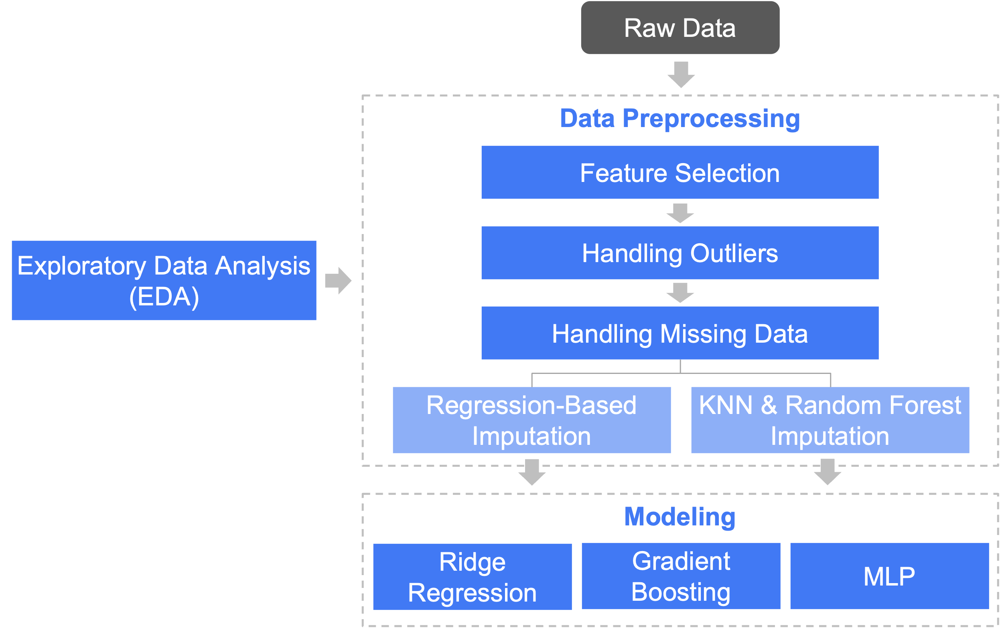

# Predicting Problematic Internet Use (PIU) in Youth Using Physical Activity Data

This repository explores the potential of using physical activity data to predict **Problematic Internet Use (PIU)** in children and adolescents. The project is inspired by the Kaggle competition [Child Mind Institute: Problematic Internet Use](https://www.kaggle.com/competitions/child-mind-institute-problematic-internet-use/overview).

## Overview

Problematic Internet Use is a significant concern with implications for mental health and well-being. This project investigates the relationship between physical activity and PIU, applying supervised machine learning techniques (e.g., regression and classification models) to predict PIU levels from the provided dataset.

## Methods & Data Pipeline

The dataset, including physical activity data and PIU labels, is sourced from the Kaggle competition and stored in the `dataset` folder. Below is the data pipeline for processing and modeling:

### Key Steps:

1. **Exploratory Data Analysis (EDA)**:
   - Perform visualizations and analyze trends and correlations.  
   - Refer to `1_Exploratory_Data_Analysis_(EDA).ipynb`.

2. **Data Preprocessing**:
   - **Feature Selection**: Remove irrelevant features, drop features with >70% missing values, and exclude redundant categorical features.
   - **Outlier Removal**: Eliminate data points with abnormal values.
   - **Missing Data Handling**:
     - Regression-based imputation.
     - K-Nearest Neighbors (KNN) & random forest imputation.
   - Refer to `2_Data_Preprocessing.ipynb`.  
     - Output: 
       - `dataset/train_re.csv` (regression-based imputation).
       - `dataset/train_rf.csv` (KNN & random forest imputation).

3. **Model Selection and Training**:
   - **Ridge Regression**: Refer to `3_Ridge_Regression.ipynb`.
   - **Gradient Boosting (LightGBM + XGBoost + CatBoost)**: Refer to `4_Gradient_Boosting.ipynb`.
   - **Multilayer Perceptron (MLP)**: Refer to `5_MLP.ipynb`.

4. **Evaluation**:
   - Assess model performance using metrics including:
     - **Accuracy**.
     - **Quadratic Weighted Kappa (QWK)**.

---

This README provides a high-level overview of the project. For detailed steps, code, and results, refer to the corresponding `.ipynb` files in the repository.
